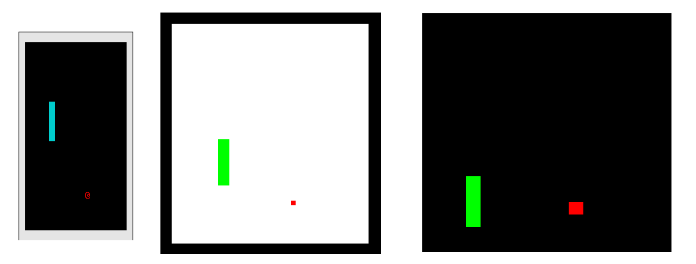
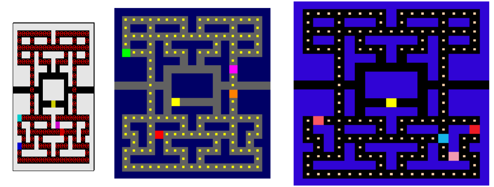

# Arcade
Arcade is a gaming platform which includes 2 games and which is able to run 3 different GUIs.





## What does it use?
  - Ncurses
  - SDL2
  - openGL
  - glut

## How does it work ?
Games and GUIs are in dynamicly loaded libraries and work only with a core.


#### Games libraries
  - Snake
  - Pacman

#### Graphics libraries
  - Ncurses
  - SDL
  - openGL

## How to run ?
To compile, use this command:

```sh
$ > make
```

You can start the program by using this command where $(LIBNAME) is the name of the graphics library used or the name of the game.

```sh
$ > ./arcade ./lib/lib_arcade_$(LIBNAME).so
```
  
  - '2’ : Previous graphics library.
  - ’3’ : Next graphics library.
  - ’4’ : Previous game.
  - ’5’ : Next game.
  - '6' : Back to the menu
  - ’8’ : Restart the game.
  - Escape: Exit.
  
## Can I help you?
Of course ! By hitting the :star: button !
